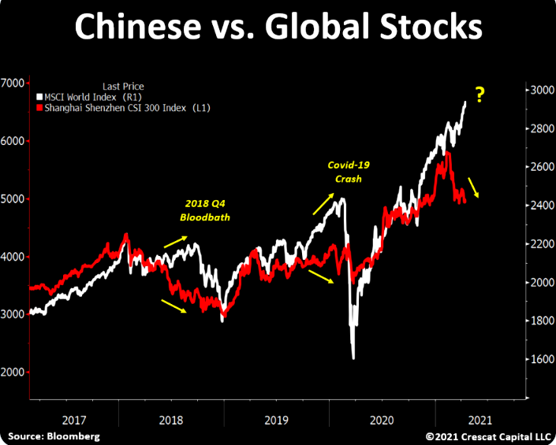
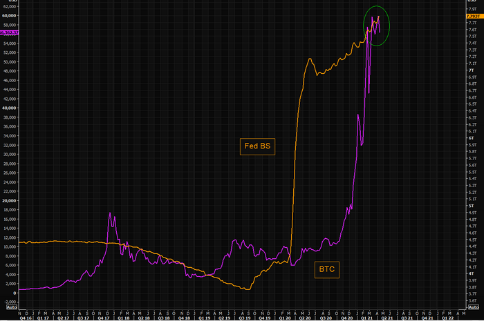

# The day

## Bear baiting

The latest Bear Cave letter is out. 
https://thebearcave.substack.com/p/the-bear-cave-62

I strongly suggest you [sign up](https://thebearcave.substack.com/).

I've extracted some of the tips.

### NYSE:QS

Fantasy battery technology. Another Theranos, this time for batteries.

### NASDAQ:NTGR

Netgear, home hi-fi hardware, eroding sales, tired product.

### NASDAQ:EQOS

Diginex: another crypto exchange Ponzi. HK based, which increases risk.

### NASDAQ:LFMD

LifeMD. Telehealth co. which uses unregistered doctors to dispense OTC medications. 

### Takeover arbitrage

Koneko Research published a report titled “Long SOHU Short SOGO” Koneko argued,

    “The current market price of SOGO implies a high likelihood that its $9/ADS acquisition by Tencent will be successful while the current market price of SOHU implies a very significant likelihood of failure. A hedged position has a high probability, but not a guarantee, of an attractive return regardless of the deal outcome.”
    
Tricky to implement, imho.

### NASDAQ:RIOT

Another crypto Ponzi.

## Einhorn and the Arch Egos

[Someone picked up on the fact that Bill Hwang was pumping $GSX](https://markets.businessinsider.com/news/stocks/david-einhorn-investor-letter-archegos-gsxtechedu-stock-trading-real-story-2021-4-1030314247) and that this is straightforward stock market manipulation, which the SEC should do something about. Except we know it turns a blind eye to any activity that lifts the price of Ponzi stocks.

## Chinese puzzle

There are a lot of very overvalued Chinese stocks. 
There have always been a lot of very overvalued Chinese stocks. 
The question is: why is the market behaving differently now?
From TME.

## Bitcoin represents freedom from the Fed

… on the other hand, maybe not.

## The Fed and inequality

Central banks maintain that their job is price stability, which they have defined to mean a steady decline in the purchasing power of money.
The Fed has the famous "dual mandate" to maintain "full employment." 
Now they all want to fix climate change, and abolish racial inequality.
Truly, they are omnipotent in a way nobody would have believed in the 80's.

The weird thing is that productivity has been low, and inequality rising, more or less the whole time that central banks have appeared to have control of inflation.
Inflation, like unemployment (and hence "full employment") are highly abstract words with a multiplicity of definitions. 
Certainly, full employment does not involve getting unemployment down to zero, or labour participation much above sixty percent. 

We are in an era where returns to capital have been huge compared to returns to labour. 
If you don't believe me, take a look at [WTF happened in 1971?](https://wtfhappenedin1971.com/).
Something needs to change, before we see a serious breakdown in civil order.

