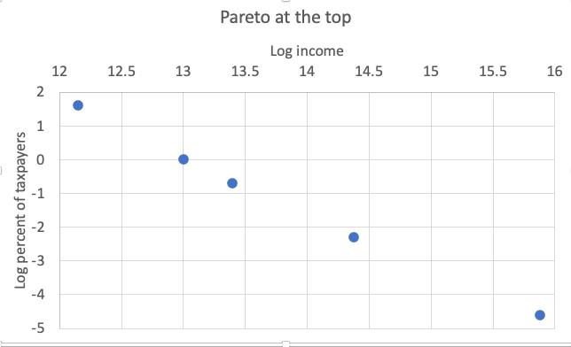

# The weekend

## Taxing the rich

Krugman has a post on [taxing the rich](https://www.nytimes.com/2021/04/30/opinion/tax-cuts-rich.html).
It makes the point that it's very unlikely that a tax increase for the very rich will make them work less.
I has a great chart of income against cumulative distribution. It's almost a perfectly straight line, when plotted as a log-log graph.
A vast number of relationships in physics have a log-log relationship, but few things in social sciences are so quantitative.

I've been vaguely aware that a Pareto distribution arises from an exponential growth rate of wealth in a population with a distribution of investment horizons. 
[This paper](https://www.aeaweb.org/articles?id=10.1257/jep.29.1.29) gives some details, and some pointers to a more rigorous explanation of how the distribution arises.

Krugman's post is designed to stiffen the spine of Biden in his announced policy of increasing taxation of capital.
I have been very surprised at the speed and efficience of Biden in getting bills through parliament. 
I read today that [Ron Klain](https://en.wikipedia.org/wiki/Ron_Klain) is the power behind the throne. 
The article is in the Sunday Times, and behind a paywall. It asserts that Biden wants to leave a legacy so he is remembered alongside FDR. 
Probably alongside Reagan too, but maybe he didn't want to say the name.
Anyway, he seems to be going about the job in an effective way.
I suspect that all the presidents who are remembered fondly actually did much more harm than good, but big programmes like the New Deal and the Great Society always get a pass, because the harm they did often comes later, or is never connected closely to the programme. 
An impairment of potential growth of 0.5% doesn't sound much, but over decades produces a big cumulative shortfall of GDP. 

## Bison Recommendations

Bison Interests (formerly Bison Energy) is a great firm with a free montly newsletter. Sign up [here](https://bisoninterests.com).
They are bullish on oil, and recommending $TSX:BTE:

> Baytex Energy ([OTCPK:BTEGF](https://seekingalpha.com/symbol/BTEGF?source=content_type%3Areact%7Csection%3Amain_content%7Cbutton%3Abody_link "Baytex Energy Corp.")) is a cheap, levered oil stock, with assets in the Eagle Ford and heavy and light unconventional Canadian oil resource plays. The stock has upside to $2.50 from here, almost a double, just from trading up in line with comps at $60 oil. As oil rises, Baytex's financial leverage and large development inventory provides substantial upside "torque". And Baytex just discovered oil, in a discovery that may be worth 15-50% of its current market cap and has not yet been press released. There is upside to $10-15 per share, from recent levels of $1.30-1.40. All numbers in Canadian dollars.

I am sure they made sure their own buy orders were filled before sending this out, but the thesis looks worth further investigation. The stock does not seem to have moved yet.
Micro cap companies are notorious for price manipulation and misleading filings, so take professional advice before investing a dime etc. etc.

## Fertilizer

There is a huge spike in the price of food commodities, which may or may not be down to the very active fiscal policies being pursued by the US Treasury and elsewhere.
The impact may already be in the price of soybeans, but I think there may be upside in fertilizer companies.
Three interesting plays are Yara ($OSE:YAR), Mosiac ($NYSE:MOS) and Nutrien ($TSX:NTR). 
Yara is the most conservatively managed, but might be the safest bet.
There is a good, recent review of the sector [here](https://finance.yahoo.com/news/global-150-billion-chemical-fertilizers-084300330.html) from [Research and Markets](https://www.researchandmarkets.com/reports/5240331/chemical-fertilizers-global-market-report-2021). The stocks I mentioned were discussed by John Dizard in this weekend's FT.

